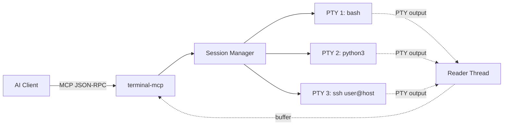
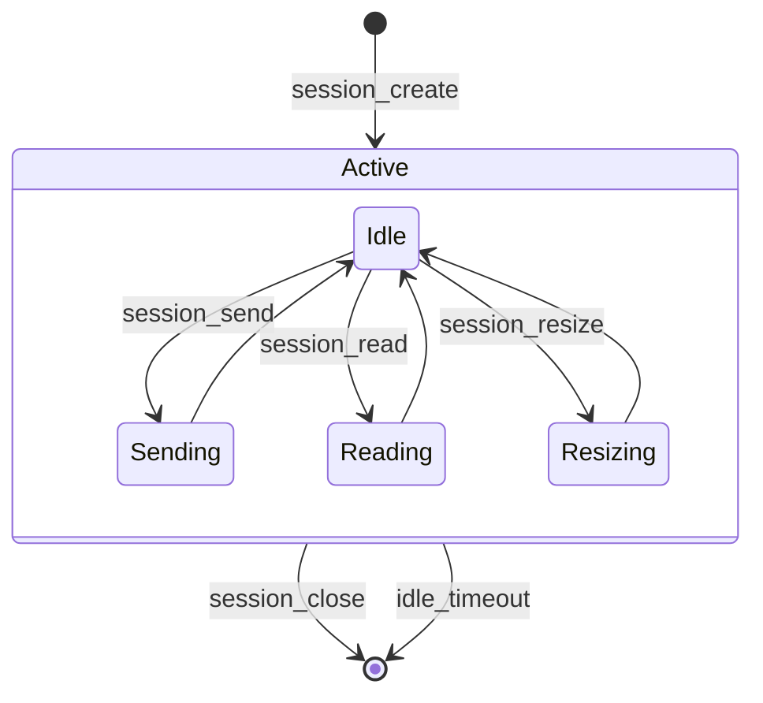

<!-- mcp-name: io.github.mkpvishnu/terminal-mcp -->

<p align="center">
  
</p>

<p align="center">
  <strong>MCP server for interactive terminal sessions — SSH, REPLs, database CLIs, and TUI apps.</strong>
</p>

<p align="center">
  <a href="https://pypi.org/project/terminal-mcp/"></a>
  <a href="https://www.python.org/downloads/"></a>
  <a href="LICENSE"></a>
  <a href="https://github.com/mkpvishnu/terminal-mcp/actions/workflows/ci.yml"></a>
  <a href="https://github.com/mkpvishnu/terminal-mcp/actions/workflows/codeql.yml"></a>
</p>

<p align="center">
  <a href="https://insiders.vscode.dev/redirect/mcp/install?name=terminal-mcp&config=%7B%22command%22%3A%22uvx%22%2C%22args%22%3A%5B%22terminal-mcp%22%5D%7D"></a>
  <a href="https://insiders.vscode.dev/redirect/mcp/install?name=terminal-mcp&config=%7B%22command%22%3A%22uvx%22%2C%22args%22%3A%5B%22terminal-mcp%22%5D%7D"></a>
  <a href="cursor://anysphere.cursor-mcp/install?name=terminal-mcp&config=eyJjb21tYW5kIjoidXZ4IiwiYXJncyI6WyJ0ZXJtaW5hbC1tY3AiXX0="></a>
  <a href="#register-with-claude-desktop"></a>
</p>

<p align="center">
  
</p>

---

## Why This Exists

If you've hit any of these limitations with Claude Code, terminal-mcp solves them:

- **"Claude Code can't handle interactive sessions"** — The built-in Bash tool runs each command in a fresh subprocess. No persistence, no back-and-forth.
- **"SSH not supported in Claude Code"** — You can't SSH into a server and run multiple commands across an active connection.
- **"Claude Code Bash tool doesn't support REPLs"** — Python, Node, Ruby, and other interpreters need a persistent session for multi-line interaction.
- **"How to use psql / mysql / redis-cli with Claude Code"** — Database CLIs require a live connection that survives across tool calls.
- **"Interactive terminal not working in Claude Code"** — TUI apps (htop, vim, ncdu, fzf) need a real PTY with special key support.
- **"Claude Code can't send arrow keys or Tab"** — The Bash tool has no concept of terminal escape sequences.

terminal-mcp fills this gap by exposing MCP tools that create and manage real PTY sessions. Each session runs as a persistent child process; you send input, special keys, and control characters and read output across multiple tool calls for as long as the session lives.

## Features

- **Persistent PTY sessions** — real terminal sessions that survive across tool calls
- **Send + read in one call** — `session_interact` combines send and read, halving LLM round trips
- **Regex-triggered reads** — `session_wait_for` blocks until a pattern matches in output — no more guessing timeouts
- **Dangerous command gate** — detects risky commands (`rm -rf`, `DROP TABLE`, `curl|sh`, etc.) and requires confirmation
- **OSC 133 shell integration** — auto-detects command boundaries and exit codes from modern shells
- **Special key support** — arrow keys, Tab, Escape, function keys (F1–F12), Home/End, Page Up/Down
- **Control characters** — Ctrl-C, Ctrl-D, Ctrl-Z, Ctrl-L, and telnet escape
- **Four read modes** — stream (waits for output to settle), snapshot (pyte screen buffer), auto (auto-detects TUI apps), and diff (returns only changed screen lines)
- **Auto TUI detection** — automatically detects alternate screen buffer (htop, vim, etc.) and switches to snapshot mode
- **Output diff mode** — returns only changed lines since last read, minimizing tokens for TUI monitoring
- **Intelligent truncation** — four truncation modes: `tail` (default), `head_tail` (preserves beginning and end), `tail_only` (for build logs), `none`
- **ANSI stripping** — optional removal of escape sequences for clean text output
- **Idle cleanup** — automatic session cleanup after configurable timeout
- **Session management** — list, label, and manage multiple concurrent sessions
- **Dynamic resize** — resize terminal dimensions on the fly with SIGWINCH support
- **Secret input** — send passwords without logging them
- **Scrollback history** — access terminal scrollback buffer beyond the visible screen
- **One-shot execution** — run a single command without manual session management
- **Smart output truncation** — four truncation strategies (`tail`, `head_tail`, `tail_only`, `none`) to prevent context overflow while preserving the most useful output
- **Env var configuration** — configure all settings via `TERMINAL_MCP_*` environment variables
- **PyPI distribution** — install directly with `pip install terminal-mcp`

## Supported Clients

| Client | Status | Install |
|--------|--------|---------|
| **Claude Code** (CLI) | ✅ Supported | `~/.claude.json` or `.mcp.json` |
| **Claude Desktop** | ✅ Supported | [One-click install](#register-with-claude-desktop) |
| **VS Code** (Copilot Chat) | ✅ Supported | [One-click install](https://insiders.vscode.dev/redirect/mcp/install?name=terminal-mcp&config=%7B%22command%22%3A%22uvx%22%2C%22args%22%3A%5B%22terminal-mcp%22%5D%7D) or `.vscode/mcp.json` |
| **Cursor** | ✅ Supported | [One-click install](cursor://anysphere.cursor-mcp/install?name=terminal-mcp&config=eyJjb21tYW5kIjoidXZ4IiwiYXJncyI6WyJ0ZXJtaW5hbC1tY3AiXX0=) or Settings → MCP |
| **Windsurf** | ✅ Supported | `~/.codeium/windsurf/mcp_config.json` |

## Quickstart

### Install

**Recommended** — no install needed:

```bash
uvx terminal-mcp
```

**Or install via pip:**

```bash
pip install terminal-mcp
```

**Or from source:**

```bash
git clone https://github.com/mkpvishnu/terminal-mcp.git
cd terminal-mcp
pip install -e ".[dev]"
```

### Register with Claude Code

Add to `~/.claude.json` (or project `.mcp.json`):

```json
{
  "mcpServers": {
    "terminal": {
      "command": "uvx",
      "args": ["terminal-mcp"]
    }
  }
}
```

### Register with Claude Desktop

Add to your `claude_desktop_config.json`:

```json
{
  "mcpServers": {
    "terminal": {
      "command": "uvx",
      "args": ["terminal-mcp"]
    }
  }
}
```

### Register with VS Code / Cursor

Click the one-click install badge above, or add to `.vscode/mcp.json`:

```json
{
  "servers": {
    "terminal-mcp": {
      "command": "uvx",
      "args": ["terminal-mcp"]
    }
  }
}
```

### Verify it works

```
session_exec  exec="echo hello from terminal-mcp"
```

## Demo

<details>
<summary><strong>SSH session to a remote server</strong></summary>

```
session_create  command="ssh user@myserver.example.com"  label="prod-ssh"
session_read    session_id="a1b2c3d4"  timeout=5.0
session_send    session_id="a1b2c3d4"  password="mypassword"
session_send    session_id="a1b2c3d4"  input="df -h"
session_read    session_id="a1b2c3d4"
session_close   session_id="a1b2c3d4"
```

</details>

<details>
<summary><strong>Python REPL</strong></summary>

```
session_create  command="python3"  label="repl"
session_read    session_id="e5f6g7h8"
session_send    session_id="e5f6g7h8"  input="import math"
session_send    session_id="e5f6g7h8"  input="print(math.sqrt(144))"
session_read    session_id="e5f6g7h8"
session_close   session_id="e5f6g7h8"
```

</details>

<details>
<summary><strong>TUI navigation with special keys</strong></summary>

```
session_create  command="python3 -m openclaw configure"  label="openclaw"
session_read    session_id="x1y2z3w4"  timeout=3.0
session_send    session_id="x1y2z3w4"  key="down"
session_send    session_id="x1y2z3w4"  key="down"
session_send    session_id="x1y2z3w4"  key="enter"
session_read    session_id="x1y2z3w4"
session_send    session_id="x1y2z3w4"  key="tab"
session_read    session_id="x1y2z3w4"
session_close   session_id="x1y2z3w4"
```

</details>

<details>
<summary><strong>Auto TUI detection and diff mode</strong></summary>

```
session_create   command="htop"  label="monitor"
session_read     session_id="a1b2c3d4"
→ auto-detects TUI, returns snapshot with mode_used="snapshot", tui_active=true

session_read     session_id="a1b2c3d4"  mode="diff"
→ returns only changed lines since last read

session_read     session_id="a1b2c3d4"  mode="diff"
→ returns only lines that changed, minimizing tokens

session_close    session_id="a1b2c3d4"
```

</details>

<details>
<summary><strong>One-shot command execution</strong></summary>

```
session_exec  exec="ls -la /tmp"
session_exec  exec="python3 -c 'print(42)'"  command="bash"  timeout=10.0
```

</details>

<details>
<summary><strong>Send + read in one call (session_interact)</strong></summary>

```
session_create   command="bash"  label="demo"
session_interact session_id="a1b2c3d4"  input="ls -la"  wait_for="\\$\\s*$"  timeout=5.0
session_interact session_id="a1b2c3d4"  input="whoami"  wait_for="\\$"
session_close    session_id="a1b2c3d4"
```

</details>

<details>
<summary><strong>Wait for specific output pattern</strong></summary>

```
session_create   command="bash"  label="build"
session_send     session_id="a1b2c3d4"  input="npm run build"
session_wait_for session_id="a1b2c3d4"  pattern="Build complete|ERROR"  timeout=60.0
session_close    session_id="a1b2c3d4"
```

</details>

<details>
<summary><strong>Dangerous command confirmation</strong></summary>

```
session_send    session_id="a1b2c3d4"  input="rm -rf /tmp/old"
→ returns: requires_confirmation=true, reason="Matched dangerous pattern: ..."

session_send    session_id="a1b2c3d4"  input="rm -rf /tmp/old"  confirmed=true
→ executes the command
```

</details>

<details>
<summary><strong>Sending Ctrl-C to interrupt</strong></summary>

```
session_send    session_id="a1b2c3d4"  control_char="c"
session_read    session_id="a1b2c3d4"
```

</details>

## Tool Reference

### session_create

Spawn a persistent PTY terminal session.

| Parameter | Type | Required | Default | Description |
|-----------|------|----------|---------|-------------|
| `command` | string | Yes | — | Shell command to run (e.g. `bash`, `python3`, `ssh user@host`) |
| `label` | string | No | command name | Human-readable label |
| `rows` | integer | No | 24 | Terminal height |
| `cols` | integer | No | 80 | Terminal width |
| `idle_timeout` | integer | No | 1800 | Seconds before auto-close |
| `enable_snapshot` | boolean | No | true | Deprecated: snapshot is now always enabled |
| `scrollback_lines` | integer | No | 1000 | Scrollback history lines |

**Returns:** `session_id`, `label`, `pid`, `created_at`, `snapshot_available`

### session_send

Send input text, a control character, or a special key to an active session. Only one of `input`, `control_char`, `key`, or `password` may be provided per call.

| Parameter | Type | Required | Default | Description |
|-----------|------|----------|---------|-------------|
| `session_id` | string | Yes | — | Session ID from `session_create` |
| `input` | string | No | — | Text to send |
| `press_enter` | boolean | No | true | Append carriage return after input |
| `control_char` | string | No | — | Control character: `c` `d` `z` `l` `]` |
| `key` | string | No | — | Special key (see table below) |
| `password` | string | No | — | Password or secret (not logged) |
| `confirmed` | boolean | No | false | Bypass dangerous command gate |

**Returns:** `bytes_sent` — or `requires_confirmation`, `reason` if the command matches a dangerous pattern

<details>
<summary>Supported special keys</summary>

| Key | Description | Key | Description |
|-----|-------------|-----|-------------|
| `up` | Arrow up | `f1`–`f12` | Function keys |
| `down` | Arrow down | `home` | Home |
| `left` | Arrow left | `end` | End |
| `right` | Arrow right | `page-up` | Page Up |
| `tab` | Tab | `page-down` | Page Down |
| `shift-tab` | Shift+Tab | `insert` | Insert |
| `escape` | Escape | `delete` | Delete |
| `enter` | Enter | `backspace` | Backspace |

</details>

<details>
<summary>Supported control characters</summary>

| Char | Signal | Description |
|------|--------|-------------|
| `c` | SIGINT | Interrupt (Ctrl-C) |
| `d` | EOF | End of file / logout (Ctrl-D) |
| `z` | SIGTSTP | Suspend (Ctrl-Z) |
| `l` | — | Clear screen (Ctrl-L) |
| `]` | — | Telnet escape |

</details>

### session_resize

Resize the terminal window of an active session.

| Parameter | Type | Required | Default | Description |
|-----------|------|----------|---------|-------------|
| `session_id` | string | Yes | — | Session ID |
| `rows` | integer | Yes | — | New terminal height |
| `cols` | integer | Yes | — | New terminal width |

**Returns:** `rows`, `cols`

### session_read

Read output from a session.

| Parameter | Type | Required | Default | Description |
|-----------|------|----------|---------|-------------|
| `session_id` | string | Yes | — | Session ID |
| `mode` | string | No | `auto` | `auto`, `stream`, `snapshot`, or `diff` |
| `timeout` | number | No | 2.0 | Settle timeout in seconds (stream/auto mode) |
| `strip_ansi` | boolean | No | true | Strip ANSI escape sequences |
| `scrollback` | integer | No | — | Lines of scrollback history (snapshot mode) |
| `truncation` | string | No | config default | Truncation mode: `tail`, `head_tail`, `tail_only`, `none` |

**Returns:** `output`, `bytes_read`, `prompt_detected`, `is_alive`, `truncated`, `tui_active`, `snapshot_available`, `mode_used`, `changed_lines` (diff mode), `is_first_read` (diff mode), `total_lines` (scrollback), `osc133`, `command_state`, `exit_code`, `command_complete` (shell integration)

### session_close

Terminate a session gracefully (EOF → SIGHUP → SIGKILL).

| Parameter | Type | Required | Description |
|-----------|------|----------|-------------|
| `session_id` | string | Yes | Session ID to close |

**Returns:** `exit_status` — or `already_closed: true` if the session was already terminated (idempotent)

### session_exec

Execute a command in a temporary session and return output. The session is automatically cleaned up.

| Parameter | Type | Required | Default | Description |
|-----------|------|----------|---------|-------------|
| `exec` | string | Yes | — | Command to execute |
| `command` | string | No | `bash` | Shell to use |
| `timeout` | number | No | 5.0 | Seconds to wait for output |
| `rows` | integer | No | 24 | Terminal height |
| `cols` | integer | No | 80 | Terminal width |
| `truncation` | string | No | config default | Truncation mode: `tail`, `head_tail`, `tail_only`, `none` |

**Returns:** `output`, `bytes_read`, `session_id`, `truncated`

### session_interact

Send input and read output in a single call. Combines `session_send` + `session_read` to halve round trips. Optionally waits for a regex pattern in the output.

| Parameter | Type | Required | Default | Description |
|-----------|------|----------|---------|-------------|
| `session_id` | string | Yes | — | Session ID |
| `input` | string | No | — | Text to send |
| `press_enter` | boolean | No | true | Append carriage return after input |
| `control_char` | string | No | — | Control character: `c` `d` `z` `l` `]` |
| `key` | string | No | — | Special key (see session_send) |
| `password` | string | No | — | Password or secret (not logged) |
| `wait_for` | string | No | — | Regex pattern to wait for in output |
| `timeout` | number | No | 5.0 | Seconds to wait for output |
| `strip_ansi` | boolean | No | true | Strip ANSI escape sequences |
| `confirmed` | boolean | No | false | Bypass dangerous command gate |
| `read_mode` | string | No | `stream` | Read mode: `auto`, `stream`, `snapshot`, `diff` |
| `truncation` | string | No | config default | Truncation mode: `tail`, `head_tail`, `tail_only`, `none` |

**Returns:** `output`, `bytes_read`, `bytes_sent`, `matched` (when `wait_for` used), `prompt_detected`, `is_alive`, `truncated`, `tui_active`, `mode_used`, `snapshot_available`

### session_wait_for

Read output from a session until a regex pattern matches or timeout expires. Use this instead of `session_read` when you know what output to expect.

| Parameter | Type | Required | Default | Description |
|-----------|------|----------|---------|-------------|
| `session_id` | string | Yes | — | Session ID |
| `pattern` | string | Yes | — | Regex pattern to wait for in output |
| `timeout` | number | No | 30.0 | Max seconds to wait |
| `strip_ansi` | boolean | No | true | Strip ANSI escape sequences |
| `truncation` | string | No | config default | Truncation mode: `tail`, `head_tail`, `tail_only`, `none` |

**Returns:** `output`, `bytes_read`, `matched`, `prompt_detected`, `is_alive`, `truncated`

### session_list

List all active sessions with their status and idle time.

**Returns:** `sessions` (array with `tui_active`, `snapshot_available` per session), `count`

## Architecture





Each session is backed by a real PTY allocated via `pexpect.spawn`. The design has four main parts:

**Background reader thread.** A daemon thread continuously reads from the PTY file descriptor in 4096-byte chunks and appends bytes to an in-memory buffer. The thread is lock-protected and dies automatically when the child process exits.

**Output settling (stream mode).** `session_read` in stream mode polls the buffer until no new bytes have arrived for `timeout` seconds (default 2s), then returns everything written since the last read call. A hard ceiling of `timeout + 10s` prevents infinite blocking.

**Snapshot mode (always on).** All PTY output is fed into a `pyte` virtual screen buffer. In `auto` mode (the default), `session_read` automatically detects TUI applications via alternate screen buffer sequences and returns a rendered snapshot. The `diff` mode returns only changed lines since the last read, minimizing tokens for TUI monitoring.

**Idle cleanup.** `SessionManager` runs a background cleanup loop (every 60s by default) that closes sessions idle longer than their `idle_timeout`. The default timeout is 30 minutes. Concurrent sessions are capped at 10 by default.

## Configuration

All settings can be overridden via environment variables prefixed with `TERMINAL_MCP_`:

| Setting | Env Var | Default | Description |
|---------|---------|---------|-------------|
| `max_sessions` | `TERMINAL_MCP_MAX_SESSIONS` | `10` | Maximum concurrent sessions |
| `idle_timeout` | `TERMINAL_MCP_IDLE_TIMEOUT` | `1800` | Seconds before auto-close |
| `default_rows` | `TERMINAL_MCP_DEFAULT_ROWS` | `24` | Default terminal height |
| `default_cols` | `TERMINAL_MCP_DEFAULT_COLS` | `80` | Default terminal width |
| `read_settle_timeout` | `TERMINAL_MCP_READ_SETTLE_TIMEOUT` | `2.0` | Output settle timeout |
| `max_output_bytes` | `TERMINAL_MCP_MAX_OUTPUT_BYTES` | `100000` | Max bytes per read |
| `cleanup_interval` | `TERMINAL_MCP_CLEANUP_INTERVAL` | `60` | Seconds between cleanup |
| `max_buffer_bytes` | `TERMINAL_MCP_MAX_BUFFER_BYTES` | `1000000` | Per-session PTY buffer cap in bytes |
| `safety_gate` | `TERMINAL_MCP_SAFETY_GATE` | `on` | Dangerous command gate (`off` to disable) |
| `dangerous_patterns` | `TERMINAL_MCP_DANGEROUS_PATTERNS` | built-in | Extra patterns (semicolon-separated regexes) |
| `truncation_mode` | `TERMINAL_MCP_TRUNCATION_MODE` | `tail` | Default truncation strategy (`tail`, `head_tail`, `tail_only`, `none`) |

**Per-session parameters:** `rows`, `cols`, `idle_timeout`, and `scrollback_lines` can be set per session via `session_create`. There is no global env var for `scrollback_lines` — it defaults to `1000` lines per session. Set `scrollback_lines=0` to disable scrollback history.

### How to Set Environment Variables

Since terminal-mcp runs as a subprocess of your MCP client, environment variables must be configured in the client's MCP server configuration — not in your shell profile (`.bashrc`, `.zshrc`, etc.).

**Claude Code** (`~/.claude.json` or project `.mcp.json`):

```json
{
  "mcpServers": {
    "terminal": {
      "command": "uvx",
      "args": ["terminal-mcp"],
      "env": {
        "TERMINAL_MCP_MAX_SESSIONS": "20",
        "TERMINAL_MCP_IDLE_TIMEOUT": "3600",
        "TERMINAL_MCP_SAFETY_GATE": "off",
        "TERMINAL_MCP_TRUNCATION_MODE": "head_tail"
      }
    }
  }
}
```

**Claude Desktop** (`claude_desktop_config.json`):

```json
{
  "mcpServers": {
    "terminal": {
      "command": "uvx",
      "args": ["terminal-mcp"],
      "env": {
        "TERMINAL_MCP_MAX_SESSIONS": "20",
        "TERMINAL_MCP_IDLE_TIMEOUT": "3600"
      }
    }
  }
}
```

**VS Code / Cursor** (`.vscode/mcp.json`):

```json
{
  "servers": {
    "terminal-mcp": {
      "command": "uvx",
      "args": ["terminal-mcp"],
      "env": {
        "TERMINAL_MCP_MAX_SESSIONS": "20",
        "TERMINAL_MCP_IDLE_TIMEOUT": "3600"
      }
    }
  }
}
```

**Windsurf** (`~/.codeium/windsurf/mcp_config.json`):

```json
{
  "mcpServers": {
    "terminal": {
      "command": "uvx",
      "args": ["terminal-mcp"],
      "env": {
        "TERMINAL_MCP_MAX_SESSIONS": "20"
      }
    }
  }
}
```

You can also set env vars directly in your shell when running the server manually for testing:

```bash
TERMINAL_MCP_MAX_SESSIONS=20 TERMINAL_MCP_SAFETY_GATE=off uvx terminal-mcp
```

## Changelog

### v0.4.3

- **Fix `wait_for` matching command echo** — `session_interact` with `wait_for` no longer matches the echoed input text. Pattern matching now starts from a buffer position anchored before the send, so only genuinely new output is matched (fixes [#6](https://github.com/mkpvishnu/terminal-mcp/issues/6))
- **Fix `wait_for` matching stale buffer content** — `session_interact` with `wait_for` no longer matches pre-existing unread buffer content (startup banners, previous command output). Uses a monotonic absolute byte counter that survives buffer trims (fixes [#7](https://github.com/mkpvishnu/terminal-mcp/issues/7))
- **Idempotent `session_close`** — closing an already-closed or naturally-exited session now returns `success: true, already_closed: true` instead of a `not_found` error. Safe for `finally`-style cleanup (fixes [#8](https://github.com/mkpvishnu/terminal-mcp/issues/8))
- **Comprehensive ANSI stripping** — `strip_ansi` now handles Kitty keyboard protocol sequences, application keypad mode (`ESC=`/`ESC>`), DCS sequences, secondary DA responses, and tilde-terminated CSI sequences that leaked through during TUI exit transitions (fixes [#9](https://github.com/mkpvishnu/terminal-mcp/issues/9))

### v0.4.2

- **Fix `is_alive` race on Linux** — `is_alive` property now uses exception-safe `_is_alive()` internally, preventing `PtyProcessError` when child processes exit before `waitpid` can reap them. Fixes flaky CI failures on Linux runners

### v0.4.1

- **Auto TUI detection** — automatically detects alternate screen buffer sequences (`ESC[?1049h`, `ESC[?47h`, `ESC[?1047h`) and switches `session_read` to snapshot mode. New `mode="auto"` is now the default
- **Output diff mode** — `session_read` with `mode="diff"` returns only changed screen lines since last read, with 1-indexed line numbers and `is_first_read` flag
- **Intelligent truncation** — new `truncate_output_smart()` with four strategies: `tail` (keep beginning), `head_tail` (keep first 30% + last 70% with line-count marker), `tail_only` (keep end, ideal for build logs), `none` (disable truncation). Configurable via `truncation` parameter on all read tools or `TERMINAL_MCP_TRUNCATION_MODE` env var
- **Always-on pyte** — snapshot mode is now always initialized (no need for `enable_snapshot=true`). `enable_snapshot` parameter deprecated
- **`read_mode` on session_interact** — choose how output is read back: `auto`, `stream`, `snapshot`, or `diff`
- **Thread-safe screen reads** — `read_snapshot()` and `read_diff()` now acquire buffer lock before reading pyte screen
- Response fields: `tui_active`, `snapshot_available`, `mode_used` added to read responses; `snapshot_available` added to create and list responses

### v0.4.0

- **`session_interact` tool** — send input and read output in a single MCP call, halving round trips. Supports all input types (text, keys, control chars, passwords) with optional `wait_for` regex pattern
- **`session_wait_for` tool** — block until a regex pattern matches in session output or timeout expires. Replaces fragile timeout-based reads when you know what to expect
- **Dangerous command gate** — detects risky commands (`rm -rf`, `DROP TABLE`, `curl|sh`, `chmod 777`, etc.) and returns `requires_confirmation` instead of executing. Resend with `confirmed=true` to proceed. 17 built-in patterns, extensible via `TERMINAL_MCP_DANGEROUS_PATTERNS` env var, disable with `TERMINAL_MCP_SAFETY_GATE=off`
- **OSC 133 shell integration** — auto-detects command boundary markers emitted by modern shells (bash 5.2+, zsh, fish). When detected, read responses include `command_state`, `exit_code`, and `command_complete` fields for precise command completion tracking

### v0.3.3

- **Buffer memory cap** — per-session PTY buffer capped at 1MB (configurable via `TERMINAL_MCP_MAX_BUFFER_BYTES`), prevents unbounded memory growth on long-running sessions
- **Async event loop** — all blocking PTY calls wrapped in `asyncio.to_thread()`, unblocking the event loop for concurrent MCP requests
- **Snapshot ANSI stripping** — `strip_ansi` parameter now correctly applied in snapshot and scrollback read modes
- **Exec output truncation** — `session_exec` now applies `max_output_bytes` truncation to prevent context overflow
- **SIGTERM cleanup** — added signal handler to close all PTY sessions on SIGTERM (Docker stop, `kill`, systemd)
- **Close race condition** — `close()` now handles pexpect exceptions when child process is already reaped
- Removed unused `import atexit` from server.py

### v0.3.1

- **MCP registry publication** — added `mcp-name` marker and `server.json` for official MCP registry
- Version bump for registry metadata

### v0.3.0

- **Output truncation** — large outputs are now automatically truncated to `max_output_bytes` (100KB default)
- **Environment variable config** — all settings configurable via `TERMINAL_MCP_*` env vars
- **session_resize tool** — dynamically resize terminal dimensions (sends SIGWINCH)
- **Secret input** — `password` parameter on `session_send` for credentials (redacted from logs)
- **Scrollback buffer** — `pyte.HistoryScreen` with configurable history depth; `scrollback` param on `session_read`
- **session_exec tool** — one-shot command execution with automatic session cleanup
- **PyPI publishing** — `pip install terminal-mcp` via trusted publishing workflow

### v0.2.0

- **Special key support** — arrow keys, Tab, Escape, function keys (F1–F12), Home/End, Page Up/Down, and more via the `key` parameter on `session_send`
- **Mutual exclusivity** — `input`, `control_char`, and `key` are now validated as mutually exclusive
- Added GitHub Actions CI (Python 3.10–3.13) and CodeQL security scanning
- Added project metadata, classifiers, and MIT license

### v0.1.0

- Initial release
- Persistent PTY sessions via pexpect
- Stream and snapshot read modes
- Control character support (Ctrl-C, Ctrl-D, Ctrl-Z, Ctrl-L)
- Session management with idle cleanup

## Running Tests

```bash
pip install -e ".[dev]"
pytest tests/ -v
```

## Contributing

Contributions are welcome! Please open an issue first to discuss what you'd like to change.

1. Fork the repository
2. Create a feature branch
3. Add tests for new functionality
4. Ensure all tests pass: `pytest tests/ -v`
5. Submit a pull request

## License

[MIT](LICENSE)
