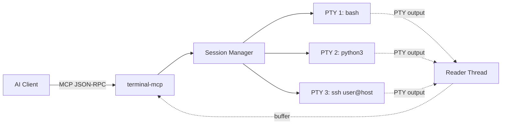

<!-- mcp-name: io.github.mkpvishnu/terminal-mcp -->

<p align="center">
  
</p>

<h3 align="center">Give your AI a real terminal. Persistent sessions. Interactive programs. Zero limitations.</h3>

<p align="center">
  <a href="https://pypi.org/project/terminal-mcp/"></a>
  <a href="https://www.python.org/downloads/"></a>
  <a href="LICENSE"></a>
  <a href="https://github.com/mkpvishnu/terminal-mcp/actions/workflows/ci.yml"></a>
  <a href="https://github.com/mkpvishnu/terminal-mcp/actions/workflows/codeql.yml"></a>
</p>

<p align="center">
  <a href="https://insiders.vscode.dev/redirect/mcp/install?name=terminal-mcp&config=%7B%22command%22%3A%22uvx%22%2C%22args%22%3A%5B%22terminal-mcp%22%5D%7D"></a>
  <a href="https://insiders.vscode.dev/redirect/mcp/install?name=terminal-mcp&config=%7B%22command%22%3A%22uvx%22%2C%22args%22%3A%5B%22terminal-mcp%22%5D%7D"></a>
  <a href="cursor://anysphere.cursor-mcp/install?name=terminal-mcp&config=eyJjb21tYW5kIjoidXZ4IiwiYXJncyI6WyJ0ZXJtaW5hbC1tY3AiXX0="></a>
  <a href="#install-in-claude-desktop"></a>
</p>

<p align="center">
  
</p>

---

## The Problem

Every AI coding tool hits the same wall: **no real terminal access**.

Claude Code's Bash tool, GitHub Copilot, and Codex all run commands in isolated subprocesses. Each command starts fresh. No state carries over. That means:

- **No SSH sessions** - Can't connect to a remote server and run multiple commands
- **No REPLs** - Can't use Python, Node, or Ruby interpreters interactively
- **No database CLIs** - Can't maintain a psql, mysql, or redis-cli connection
- **No TUI apps** - Can't navigate htop, vim, or fzf with arrow keys
- **No long-running processes** - Can't monitor builds, watch logs, or run dev servers

## The Solution

**terminal-mcp** gives AI agents a real terminal. Persistent PTY sessions that survive across tool calls. Send commands, read output, press keys, navigate TUIs - exactly like a human at a terminal.

```
uvx terminal-mcp
```

One command. Works with Claude Code, Claude Desktop, VS Code, Cursor, and Windsurf.

---

## Quick Start

### 1. Install (30 seconds)

```bash
# No install needed - run directly
uvx terminal-mcp

# Or install globally
pip install terminal-mcp
```

### 2. Connect to Your AI Client

<details open>
<summary><strong>Claude Code</strong></summary>

Add to `~/.claude.json` or project `.mcp.json`:

```json
{
  "mcpServers": {
    "terminal": {
      "command": "uvx",
      "args": ["terminal-mcp"]
    }
  }
}
```

</details>

<details>
<summary><strong>Claude Desktop</strong></summary>

Add to `claude_desktop_config.json`:

```json
{
  "mcpServers": {
    "terminal": {
      "command": "uvx",
      "args": ["terminal-mcp"]
    }
  }
}
```

</details>

<details>
<summary><strong>VS Code / Cursor</strong></summary>

Click the one-click install badge above, or add to `.vscode/mcp.json`:

```json
{
  "servers": {
    "terminal-mcp": {
      "command": "uvx",
      "args": ["terminal-mcp"]
    }
  }
}
```

</details>

<details>
<summary><strong>Windsurf</strong></summary>

Add to `~/.codeium/windsurf/mcp_config.json`:

```json
{
  "mcpServers": {
    "terminal": {
      "command": "uvx",
      "args": ["terminal-mcp"]
    }
  }
}
```

</details>

### 3. Verify

```
session_exec  exec="echo hello from terminal-mcp"
```

---

## What Can You Do With It?

### SSH Into Remote Servers

```
session_create   command="ssh user@prod-server.com"   label="prod"
session_interact session_id="a1b2c3d4"  input="df -h"  wait_for="\$"
session_interact session_id="a1b2c3d4"  input="docker ps"  wait_for="\$"
session_close    session_id="a1b2c3d4"
```

### Run Interactive REPLs

```
session_create   command="python3"  label="python"
session_interact session_id="e5f6g7h8"  input="import pandas as pd"  wait_for=">>>"
session_interact session_id="e5f6g7h8"  input="df = pd.read_csv('data.csv')"  wait_for=">>>"
session_interact session_id="e5f6g7h8"  input="df.describe()"  wait_for=">>>"
session_close    session_id="e5f6g7h8"
```

### Query Databases

```
session_create   command="psql -U admin mydb"  label="db"
session_interact session_id="x1y2z3w4"  input="SELECT count(*) FROM users;"  wait_for="row"
session_interact session_id="x1y2z3w4"  input="\dt"  wait_for="#"
session_close    session_id="x1y2z3w4"
```

### Navigate TUI Apps

```
session_create   command="htop"  label="monitor"
session_read     session_id="a1b2c3d4"
# Auto-detects TUI, returns screen snapshot

session_send     session_id="a1b2c3d4"  key="F6"
session_read     session_id="a1b2c3d4"  mode="diff"
# Returns only changed lines - saves tokens

session_send     session_id="a1b2c3d4"  key="F10"
session_close    session_id="a1b2c3d4"
```

### Monitor Long-Running Builds

```
session_create   command="bash"  label="build"
session_send     session_id="a1b2c3d4"  input="npm run build"
session_wait_for session_id="a1b2c3d4"  pattern="Build complete|ERROR"  timeout=120
```

### Run One-Off Commands

```
session_exec  exec="git log --oneline -10"
session_exec  exec="docker compose ps"  timeout=10
```

---

## Features at a Glance

| Feature | What It Does |
|---------|-------------|
| **Persistent Sessions** | Real PTY sessions that survive across tool calls |
| **Send + Read in One Call** | `session_interact` halves LLM round trips |
| **Pattern-Based Reads** | `wait_for` blocks until regex matches - no guessing timeouts |
| **Auto TUI Detection** | Detects htop, vim, etc. and auto-switches to screen snapshot mode |
| **Output Diff Mode** | Returns only changed screen lines - minimizes tokens |
| **Special Keys** | Arrow keys, Tab, F1-F12, Home/End, Page Up/Down |
| **Control Characters** | Ctrl-C, Ctrl-D, Ctrl-Z, Ctrl-L, telnet escape |
| **Dangerous Command Gate** | Blocks `rm -rf`, `DROP TABLE`, `curl\|sh` - requires confirmation |
| **OSC 133 Shell Integration** | Auto-detects command boundaries and exit codes |
| **Smart Truncation** | Four strategies to prevent context overflow |
| **Secret Input** | Send passwords without logging |
| **Dynamic Resize** | Resize terminal on the fly with SIGWINCH |
| **Idle Cleanup** | Auto-closes idle sessions |
| **Cross-Platform** | Linux, macOS, and Windows support |

---

## Tools Reference

terminal-mcp exposes **9 MCP tools**. Full details in [docs/tools.md](docs/tools.md).

| Tool | Purpose |
|------|---------|
| [`session_create`](docs/tools.md#session_create) | Spawn a persistent terminal session |
| [`session_send`](docs/tools.md#session_send) | Send text, keys, or control characters |
| [`session_read`](docs/tools.md#session_read) | Read output (stream, snapshot, auto, diff modes) |
| [`session_interact`](docs/tools.md#session_interact) | Send + read in one call |
| [`session_wait_for`](docs/tools.md#session_wait_for) | Wait for regex pattern in output |
| [`session_exec`](docs/tools.md#session_exec) | One-shot command execution |
| [`session_close`](docs/tools.md#session_close) | Close a session gracefully |
| [`session_resize`](docs/tools.md#session_resize) | Resize terminal dimensions |
| [`session_list`](docs/tools.md#session_list) | List active sessions |

---

## Architecture



Each session is backed by a real PTY via `pexpect.spawn` (or `PopenSpawn` on Windows). For full architecture details, see [docs/architecture.md](docs/architecture.md).

---

## Configuration

All settings configurable via `TERMINAL_MCP_*` environment variables. Full reference in [docs/configuration.md](docs/configuration.md).

| Setting | Env Var | Default |
|---------|---------|---------|
| Max sessions | `TERMINAL_MCP_MAX_SESSIONS` | `10` |
| Idle timeout | `TERMINAL_MCP_IDLE_TIMEOUT` | `1800` (30 min) |
| Safety gate | `TERMINAL_MCP_SAFETY_GATE` | `on` |
| Buffer cap | `TERMINAL_MCP_MAX_BUFFER_BYTES` | `1000000` (1MB) |
| Truncation | `TERMINAL_MCP_TRUNCATION_MODE` | `tail` |

Example with custom settings:

```json
{
  "mcpServers": {
    "terminal": {
      "command": "uvx",
      "args": ["terminal-mcp"],
      "env": {
        "TERMINAL_MCP_MAX_SESSIONS": "20",
        "TERMINAL_MCP_IDLE_TIMEOUT": "3600",
        "TERMINAL_MCP_TRUNCATION_MODE": "head_tail"
      }
    }
  }
}
```

---

## Documentation

| Document | Description |
|----------|-------------|
| [Tools Reference](docs/tools.md) | Complete API for all 9 MCP tools |
| [Architecture](docs/architecture.md) | How terminal-mcp works under the hood |
| [Configuration](docs/configuration.md) | All settings and environment variables |
| [Safety & Security](docs/safety.md) | Dangerous command detection and safety gate |
| [Use Cases & Examples](docs/examples.md) | Real-world recipes and patterns |
| [Changelog](docs/changelog.md) | Version history and release notes |
| [Contributing](docs/contributing.md) | How to contribute |

---

## Supported Clients

| Client | Status | Install |
|--------|--------|---------|
| **Claude Code** (CLI) | Supported | `~/.claude.json` or `.mcp.json` |
| **Claude Desktop** | Supported | [One-click install](#install-in-claude-desktop) |
| **VS Code** (Copilot Chat) | Supported | [One-click install](https://insiders.vscode.dev/redirect/mcp/install?name=terminal-mcp&config=%7B%22command%22%3A%22uvx%22%2C%22args%22%3A%5B%22terminal-mcp%22%5D%7D) or `.vscode/mcp.json` |
| **Cursor** | Supported | [One-click install](cursor://anysphere.cursor-mcp/install?name=terminal-mcp&config=eyJjb21tYW5kIjoidXZ4IiwiYXJncyI6WyJ0ZXJtaW5hbC1tY3AiXX0=) or Settings |
| **Windsurf** | Supported | `~/.codeium/windsurf/mcp_config.json` |

---

## Running Tests

```bash
pip install -e ".[dev]"
pytest tests/ -v
```

## Contributing

Contributions welcome! See [docs/contributing.md](docs/contributing.md) for guidelines.

## License

[MIT](LICENSE)
